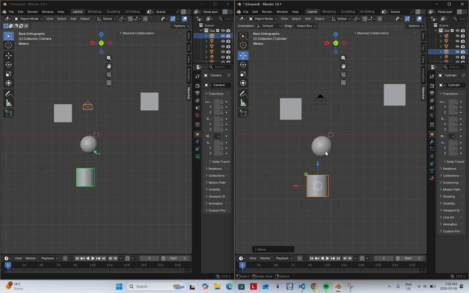
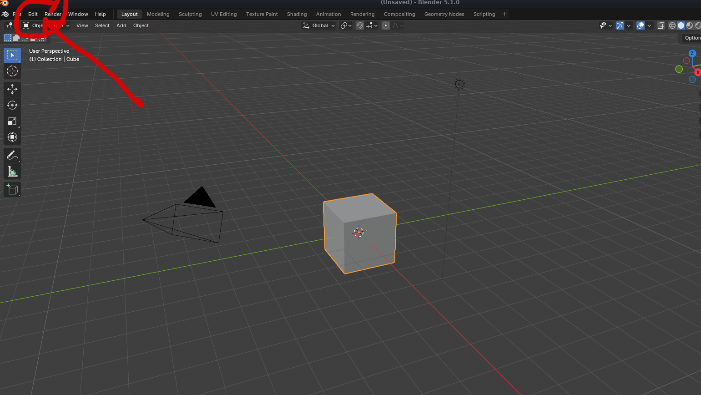
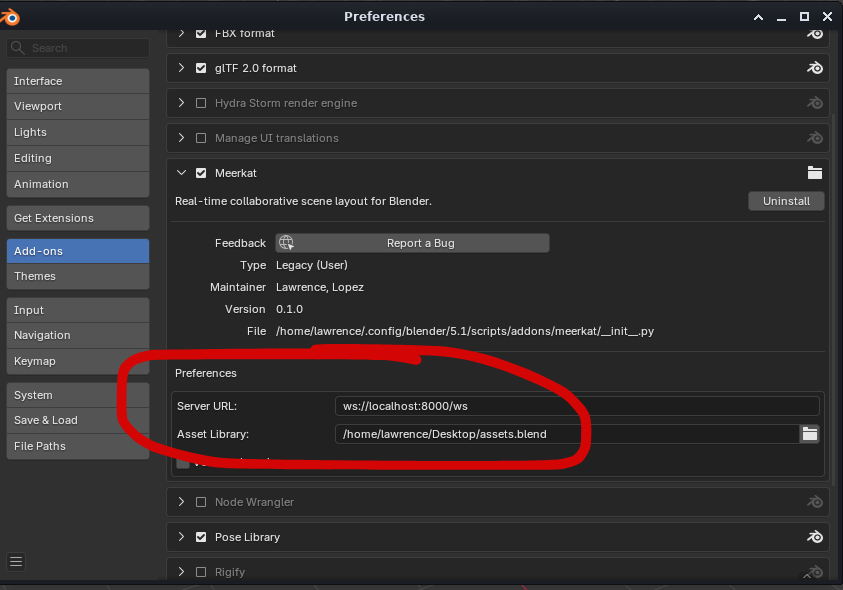
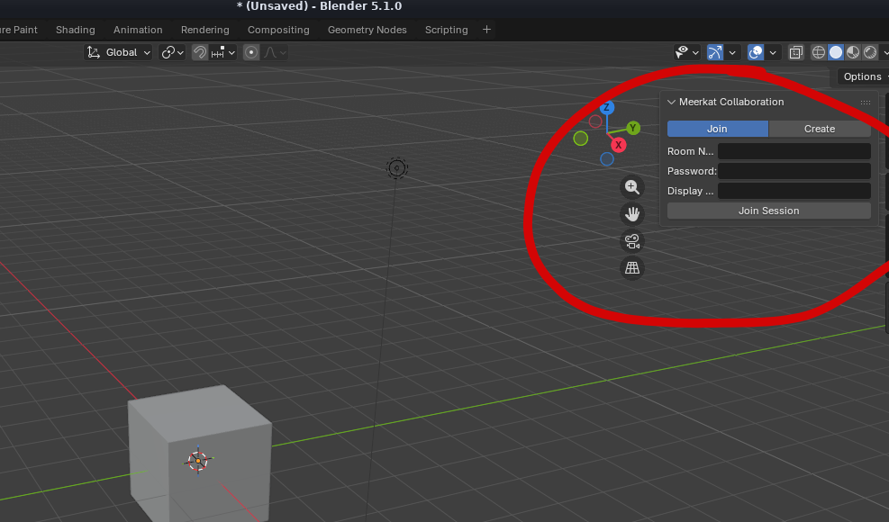

# Meerkat

[](https://www.gnu.org/licenses/gpl-3.0)
[](https://github.com/arryllopez/meerkat)
[](https://github.com/arryllopez/meerkat/pulls)
[](https://github.com/arryllopez/meerkat)
[](https://github.com/arryllopez/meerkat/discussions)

Meerkat enables realtime collaborative workflows at the object level inside of the Blender viewport.

<p align="center">
  
</p>

<p align="center">
  
</p>

---

## Contents

- [Architecture](#architecture)
- [Requirements](#requirements)
- [How To Use](#how-to-use)
  - [Install the Blender Plugin](#install-the-blender-python-plugin)
  - [Run the server](#run-the-server)
  - [Hosting on a Local Network](#hosting-over-a-local-area-network-lan)
  - [Hosting for Remote Collaborators](#remote)
  - [Connect Blender to the server](#connect-blender-to-the-server)
- [Development](#development)
- [Contributing](#contributing)
- [License](#license)

---

## Architecture


Two components:

- **Rust backend** (`tokio` + `axum`) — WebSocket sessions, object ID/transform diffing, relay. Transmits only IDs and transforms, not mesh data, so bandwidth stays minimal.
- **Python Blender plugin** — Hooks Blender's depsgraph update handlers to capture local changes and apply incoming remote deltas.

---

## Requirements

| Dependency | Purpose |
|------------|---------|
| Blender 4.0+ | Plugin host |
| Python 3.10+ | Bundled with Blender |
| Docker Desktop| https://www.docker.com/products/docker-desktop/| 

---

## How To Use

### Install the Blender Python Plugin

[Download `meerkat-blender-plugin.zip`](https://github.com/arryllopez/meerkat/releases/latest/download/meerkat-blender-plugin.zip)

In Blender, go to **Edit → Preferences → Add-ons → Install**, select the downloaded zip, then check the box beside **Meerkat** to enable.



### Run the server

Requires [Docker](https://www.docker.com/products/docker-desktop/) (Windows/macOS/Linux). Pick LAN or remote based on where your collaborators are.

### Hosting over a Local Area Network (LAN)

This setup is ideal for working in sessions where all parties are connected to the same Wi-Fi network

Run the following command in your terminal

```bash
docker run -d -p 8000:8000 --restart=unless-stopped \
  --name meerkat ghcr.io/arryllopez/meerkat-server:latest
```

In Blender, set the server URL to `ws://<your-local-ip>:8000/ws` (e.g. `ws://192.168.1.42:8000/ws`). Share that URL with anyone on the same network.

### Remote

This setup allows collaboration with anybody even on different Wi-Fi networks.

Uses [Tailscale](https://tailscale.com/download) for a free public HTTPS URL — no domain, no port forwarding, no TLS setup.

After installing Tailscale and signing in, enable **HTTPS Certificates** in the [admin console](https://login.tailscale.com/admin/dns), then:

```bash
docker run -d -p 8000:8000 --restart=unless-stopped \
  --name meerkat ghcr.io/arryllopez/meerkat-server:latest
sudo tailscale funnel 8000
```

Tailscale prints a public URL like `https://your-machine.tail-abc123.ts.net`. In Blender, use `wss://your-machine.tail-abc123.ts.net/ws`.

> Sessions are password-protected. Share the password with collaborators out-of-band (Discord, text, etc.) — without it, nobody can join even if they have the URL.

### Connect Blender to the server

In the Meerkat add-on preferences, set the **Server URL** to the one from the step above (LAN or Remote).



Then open the **Meerkat** side panel in the 3D viewport (`N` key → Meerkat tab):

| Action | Description |
|--------|-------------|
| Create Session | Start a new collaborative session |
| Join Session | Connect to an existing session by ID |
| Leave Session | Disconnect from the current session |



Once connected, use Blender normally, but see your collaborators do work in realtime within the same viewport!

---

## Development

```bash
cargo build         # Build backend binary
cargo test          # Run unit/integration tests
cargo clippy        # Lint
```

**Plugin development:**
```bash
# Symlink plugin into Blender's addons directory for live reloading
ln -s $(pwd)/blender_plugin ~/.config/blender/4.x/scripts/addons/meerkat
```

---

## Contributing

Contributions welcome — especially networking, Blender Python API, and conflict resolution strategies.

1. Fork the repository
2. Create your feature branch (`git checkout -b feat/your-feature`)
3. Commit your changes
4. Open a Pull Request

Have a question or idea? [Start a discussion](https://github.com/arryllopez/meerkat/discussions).

---

## Star History

[](https://star-history.com/#arryllopez/meerkat&Date)

---

## License

Licensed under the **GNU General Public License v3.0**.

- Use, modify, and distribute freely
- Derivative work must also be open-source under GPLv3
- No proprietary forks

See the [LICENSE](LICENSE) file for full details.
